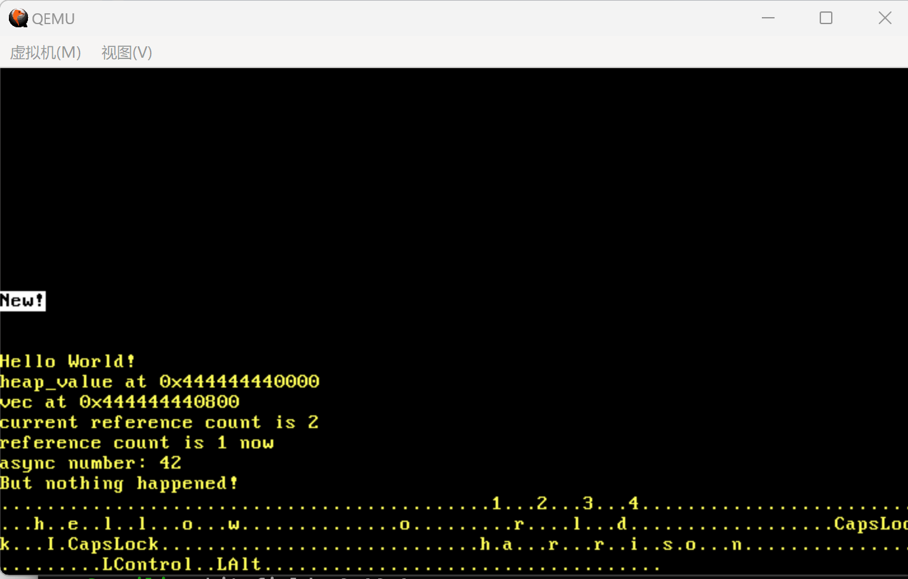

# Rust OS Kernel

A minimal operating system kernel written in Rust, designed to run on QEMU. This educational project implements basic OS functionality including memory management, interrupt handling, keyboard input, and a simple task executor. Refer to: https://os.phil-opp.com/

