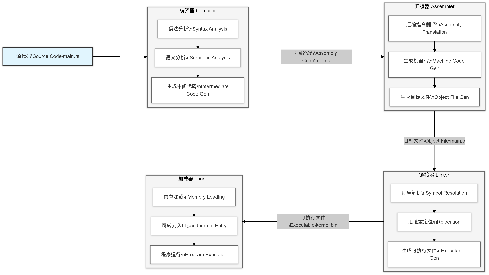

基本工具链安装:

```bash
rustup target add riscv64gc-unknown-none-elf
rustup component add rust-src
rustup component add llvm-tools-preview
```

在x86系统中，我们使用的固件标准是BIOS或者UEFI，在riscv系统中，我们使用的标准是SBI。如果我们的目标平台是真实的 RISC-V 硬件（如 SiFive 开发板），通常需要将 OpenSBI（SBI规范的具体实现） 作为固件烧录到硬件上。但我们是使用 QEMU 模拟 RISC-V 环境，所以不需要单独安装 OpenSBI，因为 QEMU 已经内置了 OpenSBI 。可以看到 `.cargo/config.toml` 下的内容：

```bash
runner = ["qemu-system-riscv64", "-machine", "virt", "-nographic", "-bios", "default", "-kernel", "target/riscv64gc-unknown-none-elf/debug/rust-os"]
```

这里的`-bios`并不是BIOS标准的意思，而是qemu里指定固件标准的参数，我们使用的是`default`，qemu默认的固件就是OpenSBI。我们作为初学者开发，QEMU默认的BIOS已经足够支持大多数场景。如果需要调试或自定义 OpenSBI，可以下载或编译 OpenSBI，并显式指定其路径。

例如：

```bash
runner = ["qemu-system-riscv64", "-machine", "virt", "-nographic", "-bios", "path/to/opensbi.bin", "-kernel", "target/riscv64gc-unknown-none-elf/debug/rust-os"]
```

计算机的电源供电后，CPU 从固定的内存地址开始执行固件代码，这个过程就是加载固件。

然后固件会从启动设备（比如硬盘、U 盘）中读取引导程序（比如 GRUB、Windows Boot Manager）。

引导程序读取操作系统的 `kernel.bin` 文件，并将其加载到内存中。然后引导程序将控制权交给内核，操作系统开始运行。

整个流程大致是这样的：


`runner`的`-kernel`参数是在指定要运行的内核文件（即编译生成的二进制文件，这里我们的内核文件是`rust-os`）。这里有个很有趣的地方，如果我们不显示指定将要运行的内核文件：

```bash
runner = ["qemu-system-riscv64", "-machine", "virt", "-nographic", "-bios", "path/to/opensbi.bin", "-kernel"]
```

然后运行`cargo build` 或者 `cargo run` 的时候，它依然可以正常工作，这是因为**cargo**会自动将生成的二进制文件作为 '-kernel' 的参数传递给 QEMU。

前面两个参数相对顾名思义很多，`-machine virt`：指定 QEMU 使用 `virt` 虚拟机器，这是一个虚拟的 RISC-V 平台。`-nographic`：禁用图形输出，只使用命令行界面。我们这里使用 `-nographic`，QEMU 会自动将串口输出重定向到命令行终端。我们在实现过程里没有配置图形化输出，相关输出都会重定向到命令行终端显示。

然后我们可以正式开发了，我们编写的操作系统，最终会生成一个二进制文件（`rust-os`），然后在QEMU上跑起来，从源代码到二进制文件的转化过程如下图所示：



我们在源代码(`main.rs`)的开头通过：`global_asm!(include_str!("arch/riscv/boot.S"));`内嵌了一段汇编代码：

```bash
    .section .text.entry
    .globl _start
_start:
    la      sp, boot_stack_top
    
    call    rust_main

    .section .bss.stack
    .globl boot_stack
boot_stack:
    .space 4096 * 16
    .globl boot_stack_top
boot_stack_top:
```

可以看到，在配置文件中，我们指定了链接器脚本的位置：

```bash
rustflags = ["-C", "link-arg=-Tsrc/arch/riscv/linker.ld"]
```

它的完整内容是：

```bash
OUTPUT_ARCH(riscv)
ENTRY(_start)
BASE_ADDRESS = 0x80200000;

SECTIONS
{
    . = BASE_ADDRESS;
    skernel = .;

    .text : {
        *(.text.entry)
        *(.text .text.*)
    }

    .rodata : {
        *(.rodata .rodata.*)
    }

    .data : {
        *(.data .data.*)
    }

    .bss : {
        *(.bss .bss.*)
    }
}
```

它们的完整工作流程是这样的（和上面图片对应起来）：

1. 编译阶段：

`boot.S` 被编译成目标文件（`boot.o`），其中包含了 `.text.entry` 段和 `.bss.stack` 段。

Rust 代码被编译成目标文件（如 `main.o`），其中包含了 `.text`、`.rodata`、`.data` 和 `.bss` 段。

2. 链接阶段：

链接器根据 `linker.ld` 将目标文件合并成可执行文件（如 `kernel.bin`）。

`.text.entry` 段被放到 `.text` 段的最前面，确保 `_start` 符号位于代码段的开头。

`.bss.stack` 段被放到 `.bss` 段，栈空间被正确分配。

3. 运行阶段：

QEMU 加载可执行文件到内存中（从 `0x80200000` 开始）。

引导程序跳转到 `_start` 符号，开始执行操作系统的启动代码。

`boot.S` 中的代码设置栈指针并跳转到 Rust 代码，操作系统的主要逻辑开始运行。

到这里，我们整个操作系统的大致框架就建立起来了，在下一节我们来完成基本的`print`功能。