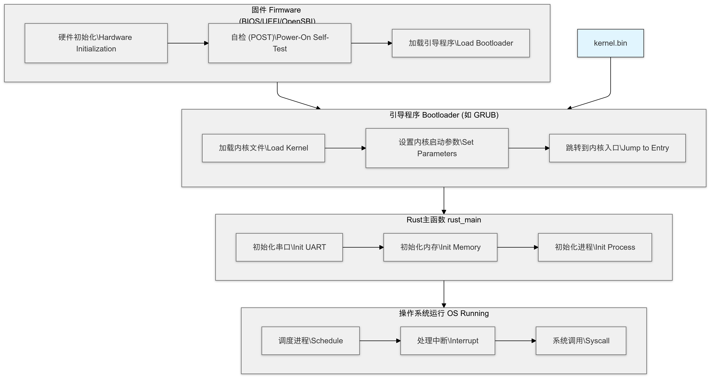

在x86系统中，我们使用的固件标准是BIOS或者UEFI，在riscv系统中，我们使用的标准是SBI。如果我们的目标平台是真实的 RISC-V 硬件（如 SiFive 开发板），通常需要将 OpenSBI（SBI规范的具体实现） 作为固件烧录到硬件上。但我们是使用 QEMU 模拟 RISC-V 环境，所以不需要单独安装 OpenSBI，因为 QEMU 已经内置了 OpenSBI 。可以看到 `.cargo/config.toml` 下的内容：

```bash
runner = ["qemu-system-riscv64", "-machine", "virt", "-nographic", "-bios", "default", "-kernel", "target/riscv64gc-unknown-none-elf/debug/rust-os"]
```

这里的`-bios`并不是BIOS标准的意思，而是qemu里指定固件标准的参数，我们使用的是`default`，qemu默认的固件就是OpenSBI。我们作为初学者开发，QEMU默认的BIOS已经足够支持大多数场景。如果需要调试或自定义 OpenSBI，可以下载或编译 OpenSBI，并显式指定其路径。

例如：

```bash
runner = ["qemu-system-riscv64", "-machine", "virt", "-nographic", "-bios", "path/to/opensbi.bin", "-kernel", "target/riscv64gc-unknown-none-elf/debug/rust-os"]
```

计算机的电源供电后，CPU 从固定的内存地址开始执行固件代码，这个过程就是加载固件。

然后固件会从启动设备（比如硬盘、U 盘）中读取引导程序（比如 GRUB、Windows Boot Manager）。

引导程序读取操作系统的 `kernel.bin` 文件，并将其加载到内存中。然后引导程序将控制权交给内核，操作系统开始运行。

整个流程大致是这样的：



`runner`的`-kernel`参数是在指定要运行的内核文件（即编译生成的二进制文件，这里我们的内核文件是`rust-os`）。这里有个很有趣的地方，如果我们不显示指定将要运行的内核文件：

```bash
runner = ["qemu-system-riscv64", "-machine", "virt", "-nographic", "-bios", "path/to/opensbi.bin", "-kernel"]
```

然后运行`cargo build` 或者 `cargo run` 的时候，它依然可以正常工作，这是因为**cargo**会自动将生成的二进制文件作为 '-kernel' 的参数传递给 QEMU。

前面两个参数相对顾名思义很多，`-machine virt`：指定 QEMU 使用 `virt` 虚拟机器，这是一个虚拟的 RISC-V 平台。`-nographic`：禁用图形输出，只使用命令行界面。我们这里使用 `-nographic`，QEMU 会自动将串口输出重定向到命令行终端。我们在实现过程里没有配置图形化输出，相关输出都会重定向到命令行终端显示。