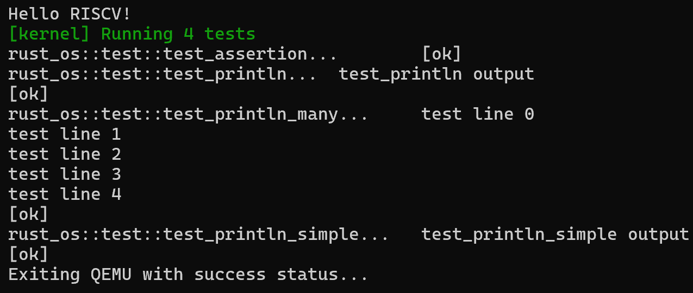

和 [blog_os](https://os.phil-opp.com/testing/)一样，我们开始自定义我们自己的测试框架。差别主要在于退出机制。那么和之前 [Println](02Println.md) 一样，我们有两种方式，一种是使用 SBI，另一种是直接往硬件里写入特定的数字来完成退出。

SBI的退出实现我们同样放到 `sbi.rs` 里方便管理：

```bash
pub fn shutdown() -> ! {
    sbi_call(SBI_SHUTDOWN, 0, 0, 0);
    panic!("It should shutdown!");
}
```

而第二种退出机制的方法，我们把它放到了 `test_device.rs`文件里，虽然放到`uart.rs`可以减少编译文件的大小，但是这里我在实现的时候没有想到更美观的组织代码的方式，就简单粗暴的把它隔离出来了。重点是关注实现方式了。

QEMU里为RISCV内置的测试设备叫做SiFive，和之前串口设备（UART NS16550A，它是8位寄存器）不一样，它使用的是32位寄存器。特定退出码是：

```bash
// Exit codes
const TEST_EXIT_PASS: u32 = 0x5555;
const TEST_EXIT_FAIL: u32 = 0x3333;
```

把退出机制封装进 `test.rs`里：

```bash
pub fn exit_qemu(exit_code: QemuExitCode) -> ! {
    let _ = exit_code;
    //crate::sbi::shutdown()
    //crate::test_device::exit_pass()
    match exit_code {
        QemuExitCode::Success => crate::test_device::exit_pass(),
        QemuExitCode::Failed => crate::test_device::exit_fail(),
    }
}
```

添加测试用例：

```bash
#[test_case]
fn test_println() {
    println!("test_println output");
}

#[test_case]
fn test_assertion() {
    assert_eq!(1 + 1, 2);
}

#[test_case]
fn test_println_simple() {
    println!("test_println_simple output");
}

#[test_case]
fn test_println_many() {
    for i in 0..5 {
        println!("test line {}", i);
    }
}
```
运行 `cargo test`后可以看到:

