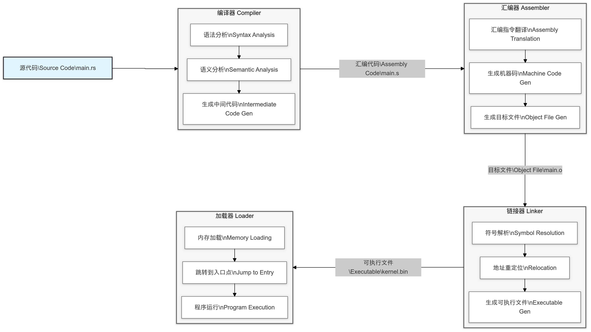

Basic Toolchain Installation

```bash
rustup target add riscv64gc-unknown-none-elf
rustup component add rust-src
rustup component add llvm-tools-preview
```

In x86 systems, the firmware standards we use are BIOS or UEFI. In RISC-V systems, the standard we use is SBI. If our target platform is real RISC-V hardware (such as a SiFive development board), we typically need to flash OpenSBI (a specific implementation of the SBI specification) as firmware onto the hardware. However, since we are using QEMU to emulate a RISC-V environment, we do not need to install OpenSBI separately because QEMU already comes with OpenSBI built-in. You can see the content in `.cargo/config.toml`:

```bash
runner = ["qemu-system-riscv64", "-machine", "virt", "-nographic", "-bios", "default", "-kernel"]
```

Here, `-bios` does not mean the BIOS standard, but rather a parameter in QEMU to specify the firmware standard. We are using `default`, which means QEMU's default firmware is OpenSBI. For beginner development, QEMU's default BIOS is sufficient to support most scenarios. If you need to debug or customize OpenSBI, you can download or compile OpenSBI and explicitly specify its path.

For example:

```bash
runner = ["qemu-system-riscv64", "-machine", "virt", "-nographic", "-bios", "path/to/opensbi.bin", "-kernel"]
```

After the computer's power is turned on, the CPU starts executing firmware code from a fixed memory address, which is the process of loading the firmware. The firmware then reads the bootloader (such as GRUB or Windows Boot Manager) from the boot device (such as a hard drive or USB drive). The bootloader reads the operating system's `kernel.bin` file and loads it into memory. The bootloader then transfers control to the kernel, and the operating system starts running.

The entire process is roughly as follows:


The `-kernel` parameter in `runner` specifies the kernel file to run (i.e., the compiled binary file, in this case, our kernel file is `rust-os`). Here, we do not need to explicitly specify the kernel file to run (`target/riscv64gc-unknown-none-elf/debug/rust-os`). When running `cargo build` or `cargo run`, it will still work correctly because **cargo** will automatically pass the generated binary file as the `-kernel` parameter to QEMU. This method of letting **cargo** handle it automatically can avoid some issues. For example, when running `cargo test`, **Cargo** generates independent executable files for each test target, and the path of these executable files is `target/riscv64gc-unknown-none-elf/debug/deps/rust_os-[hash]`, where the hash value is unique and may change with each compilation. Hardcoding the binary file path would cause `cargo test` to fail.

The first two parameters are more self-explanatory. `-machine virt`: Specifies that QEMU should use the `virt` virtual machine, which is a virtual RISC-V platform. `-nographic`: Disables graphical output and only uses the command-line interface. Here, we use `-nographic`, and QEMU will automatically redirect serial output to the command-line terminal. In our implementation, we have not configured graphical output, so all related output will be redirected to the command-line terminal.

Now we can start development. The operating system we write will eventually generate a binary file (`rust-os`), which will then run on QEMU. The process of converting source code to a binary file is shown in the following diagram:



At the beginning of our source code (`main.rs`), we embed a piece of assembly code via:

```rust
global_asm!(include_str!("arch/riscv/boot.S"));
```

The assembly code is as follows:

```bash
    .section .text.entry
    .globl _start
_start:
    la      sp, boot_stack_top
    call    rust_main

    .section .bss.stack
    .globl boot_stack
boot_stack:
    .space 4096 * 16
    .globl boot_stack_top
boot_stack_top:
```

As you can see, in the configuration file, we specified the location of the linker script:

```bash
rustflags = ["-C", "link-arg=-Tsrc/arch/riscv/linker.ld"]
```

Its full content is:

```bash
OUTPUT_ARCH(riscv)
ENTRY(_start)
BASE_ADDRESS = 0x80200000;

SECTIONS {
    . = BASE_ADDRESS;
    skernel = .;

    .text : {
        *(.text.entry)
        *(.text .text.*)
    }

    .rodata : {
        *(.rodata .rodata.*)
    }

    .data : {
        *(.data .data.*)
    }

    .bss : {
        *(.bss .bss.*)
    }
}
```

The complete workflow is as follows (corresponding to the image above):

1. **Compilation Phase**:
   - `boot.S` is compiled into an object file (`boot.o`), which contains the `.text.entry` section and the `.bss.stack` section.
   - Rust code is compiled into object files (e.g., `main.o`), which contain the `.text`, `.rodata`, `.data`, and `.bss` sections.

2. **Linking Phase**:
   - The linker merges the object files into an executable file (e.g., `kernel.bin`) according to `linker.ld`.
   - The `.text.entry` section is placed at the beginning of the `.text` section, ensuring that the `_start` symbol is at the start of the code section.
   - The `.bss.stack` section is placed in the `.bss` section, and the stack space is correctly allocated.

3. **Execution Phase**:
   - QEMU loads the executable file into memory (starting from `0x80200000`).
   - The bootloader jumps to the `_start` symbol, and the operating system's startup code begins execution.
   - The code in `boot.S` sets the stack pointer and jumps to the Rust code, and the main logic of the operating system starts running.

At this point, the general framework of our operating system is established. In the next section, we will implement the basic `print` functionality.

Provide a debugging method:

Change the `runner` in `config.toml` to:

```bash
runner = "qemu-system-riscv64 -machine virt -nographic -bios none -s -S -kernel"
```

Run the following command:

```bash
cargo run
```

Then open a new terminal, navigate to the project root directory, and execute the following command:

```bash
riscv64-unknown-elf-gdb target/riscv64gc-unknown-none-elf/debug/rust-os
```