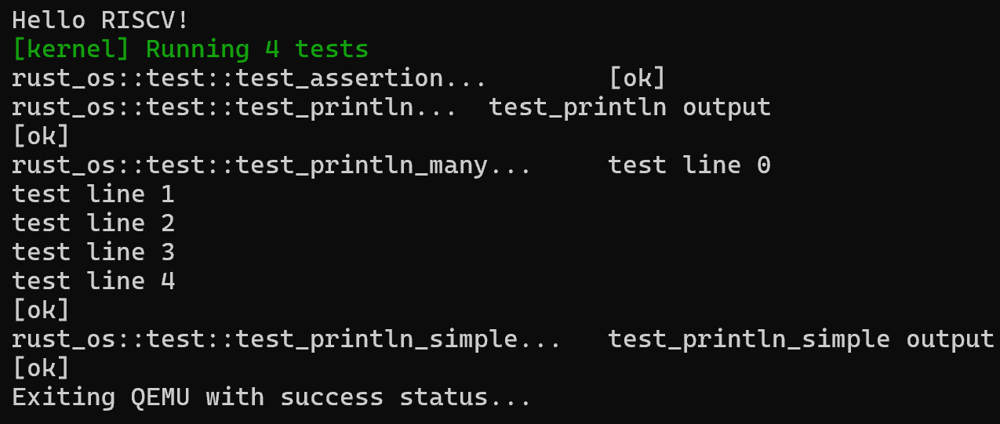

Like [blog_os](https://os.phil-opp.com/testing/), we begin by customizing our own test framework. The main difference lies in the exit mechanism. Similar to [Println](02Println.md), we have two approaches: one using SBI, and another writing specific numbers directly to hardware to accomplish the exit.

The SBI exit implementation is placed in `sbi.rs` for better management:
```rust
pub fn shutdown() -> ! {
    sbi_call(SBI_SHUTDOWN, 0, 0, 0);
    panic!("It should shutdown!");
}
```

The second exit mechanism is placed in `test_device.rs`. While putting it in `uart.rs` could reduce compilation size, I couldn't think of a more elegant way to organize the code, so I simply isolated it. The focus here is on the implementation method.

The built-in test device for RISC-V in QEMU is called SiFive. Unlike the serial device (UART NS16550A, which uses 8-bit registers), it uses 32-bit registers. The specific exit codes are:
```rust
// Exit codes
const TEST_EXIT_PASS: u32 = 0x5555;
const TEST_EXIT_FAIL: u32 = 0x3333;
```

The exit mechanism is encapsulated in `test.rs`:
```rust
pub fn exit_qemu(exit_code: QemuExitCode) -> ! {
    let _ = exit_code;
    //crate::sbi::shutdown()
    //crate::test_device::exit_pass()
    match exit_code {
        QemuExitCode::Success => crate::test_device::exit_pass(),
        QemuExitCode::Failed => crate::test_device::exit_fail(),
    }
}
```

Adding test cases:
```rust
#[test_case]
fn test_println() {
    println!("test_println output");
}

#[test_case]
fn test_assertion() {
    assert_eq!(1 + 1, 2);
}

#[test_case]
fn test_println_simple() {
    println!("test_println_simple output");
}

#[test_case]
fn test_println_many() {
    for i in 0..5 {
        println!("test line {}", i);
    }
}
```

After running `cargo test`, we can see:
